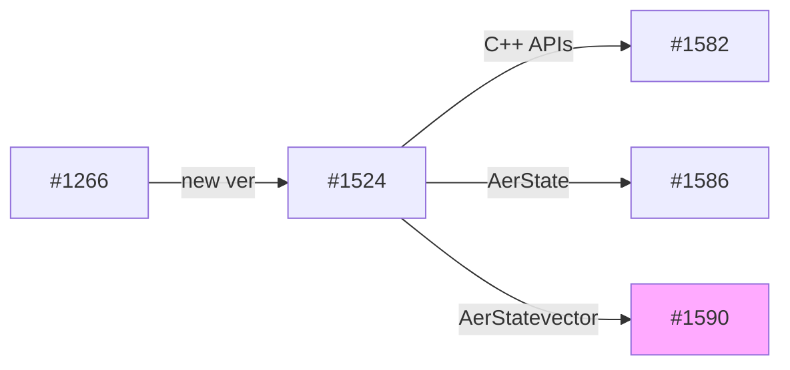

# [Qiskit/qiskit-aer](https://github.com/Qiskit/qiskit-aer)

> Qiskit is made up of elements that each work together to enable quantum computing. This element is **Aer**, which provides high-performance quantum computing simulators with realistic noise models.

initial commit: [224feda](https://github.com/Qiskit/qiskit-aer/commit/224feda211e7d92b815955a0bd2637f142b65947)

## Background

- to reduce overheads of small qubit simulation see [add more pybind for direct use of controller classes #1266](https://github.com/Qiskit/qiskit-aer/pull/1266)

## How to install

[Install from Source](https://github.com/Qiskit/qiskit-aer/blob/main/CONTRIBUTING.md#install-from-source)

### Preparetion

```sh
$ sudo apt install build-essential
$ apt-get install git
$ git clone https://github.com/Qiskit/qiskit-aer
$ cd qiskit-aer
$ pip install -r requirements-dev.txt
$ pip install conan
```

### Build

```sh
$ python ./setup.py bdist_wheel
```

It takes a little time because the shared library build runs.

## Install

### Uninstall previous version

```sh
$ pip uninstal qiskit-aer
```

### Install newer version

Recommended: (It will be installed, although an error message will appear in terms of dependencies with other modules.)

```sh
$ pip install -U dist/qiskit_aer*.whl
$ find _skbuild/linux-*/cmake-install/qiskit_aer/backends -name "controller_wrappers*.so" -exec cp {} `python -c "import site; print (site.getsitepackages()[0])"`/qiskit_aer/backends/ \;
$ ln -s `python -c "import site; print (site.getsitepackages()[0])"`/qiskit_aer `python -c "import site; print (site.getsitepackages()[0])"`/qiskit/providers/aer
```

or

```sh
$ python setup.py install
...
```

or

```sh
$ python setup.py install -e .
$ find _skbuild/linux-*/cmake-install/qiskit_aer/backends -name "controller_wrappers*.so" -exec cp {} `pwd`/qiskit_aer/backends/ \;
$ find _skbuild/linux-*/cmake-install/qiskit_aer/pulse/controllers -name "pulse_utils*.so" -exec cp {} `pwd`/qiskit_aer/pulse/controllers/ \;
$ ln -s `pwd`/qiskit_aer `python -c "import site; print (site.getsitepackages()[0])"`/qiskit/providers/aer
```

## ~~Latest code (obsoleted)~~

~~You can get the latest code from PR as a branch by doing the following:~~

```sh
$ git fetch origin pull/1590/head:add_aer_statevector
$ git checkout add_aer_statevector
```

## Sample Codes

```python
>>> from numpy import sqrt
>>> from qiskit.providers.aer.quantum_info import AerStatevector
>>> sv=AerStatevector([1/sqrt(2), 0, 0, -1/sqrt(2)])
>>> sv.draw(output='latex')
```

## Tests

More sample codes are also listed.

- [test/terra/states/test_aer_statevector.py](https://github.com/Qiskit/qiskit-aer/blob/0.11.0/test/terra/states/test_aer_statevector.py)

Terra also has many tests such as [test_statevector.py](https://github.com/Qiskit/qiskit-terra/tree/main/test/python/quantum_info/states) and [test_densitymatrix.py](https://github.com/Qiskit/qiskit-terra/blob/main/test/python/quantum_info/states/test_densitymatrix.py) for `DensityMatrix`. ([#1524](https://github.com/Qiskit/qiskit-aer/pull/1524#discussion_r952700690))

## Tips

- `AerState` is intended as an internal class. ([#1524](https://github.com/Qiskit/qiskit-aer/pull/1524#discussion_r953731761))
- `AerState` is expected to be used in `AetDensityMatrix` as well. ([#1586](https://github.com/Qiskit/qiskit-aer/pull/1586#issuecomment-1237991487))

## Sequence of inilialization

- case of `_from_ndarray` which is implemented in [be85e6d](https://github.com/Qiskit/qiskit-aer/commit/be85e6df3b073628db4f72a6f9a96b248fffa696)


## State transition of AerState


## History of PRs



- [add more pybind for direct use of controller classes #1266](https://github.com/Qiskit/qiskit-aer/pull/1266)
- [Initial input of AerState #1524](https://github.com/Qiskit/qiskit-aer/pull/1524) which is splitted into 3 PRs due to [a review comment](https://github.com/Qiskit/qiskit-aer/pull/1524#pullrequestreview-1082244663):
    - [Add libaer.so #1582](https://github.com/Qiskit/qiskit-aer/pull/1582) as the runtime C api
        - standalone build `libaer.so` which is just for experimental usages.
    - [Add AerState that allows python access simulator state directly #1586](https://github.com/Qiskit/qiskit-aer/pull/1586) as one for `AerState`
    - [Add AerStatevector #1590](https://github.com/Qiskit/qiskit-aer/pull/1590) as one for `AerStatevector` on top of `AerState`

## Overriden or added new methods in AerStatevector

- Overriden
    - `conjugate` (of Statevector)
    - `sample_memory` (of QuantumState)
- Added
    - `__copy__`
    - `__deepcopy__`
    - `__init__`
    - `_last_result`
    - `from_instruction` (@classmethod)
    - `from_label` (@classmethod)
    - `metadata`

### Affected existing methods

- by `conjugate`
    - `expectation_value` (of Statevector)
- by `sample_memory`
    - `sample_counts` (of QuantumState/Statevector)
